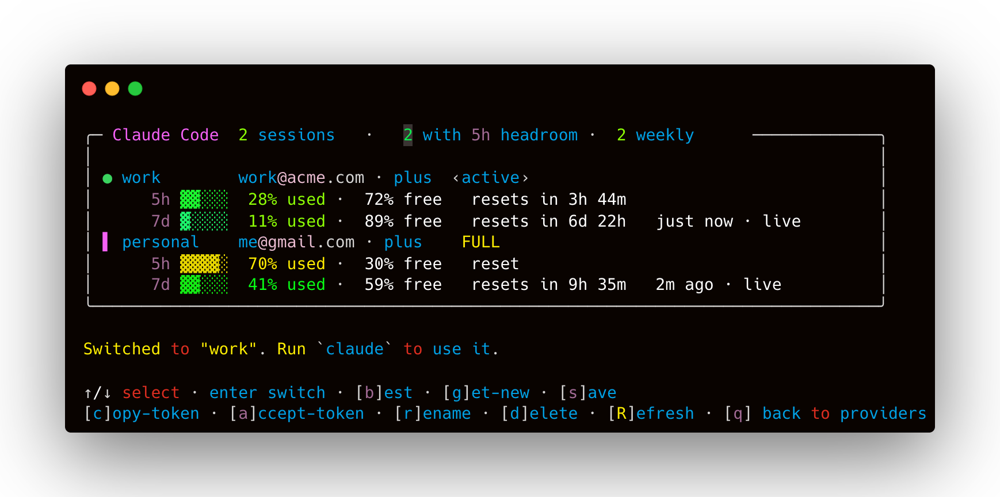

<div align="center">

# ⚡ claudecodex

**One keystroke to switch between all your Codex and Claude Code logins — and always know which account still has quota.**

[](https://www.npmjs.com/package/claudecodex)
[](https://www.npmjs.com/package/claudecodex)
[](./LICENSE)

</div>

---

Both **Codex** and **Claude Code** keep only **one** active login at a time — log into a second
account and the first is signed out. If you juggle multiple ChatGPT/Claude subscriptions (your own,
a teammate's, a friend's), you're constantly re-logging in and losing your place.

**claudecodex** saves each login as a named **session**, lets you switch between them instantly, and
shows a **live dashboard** of every account's remaining **5-hour** and **weekly** limits — read
straight from each provider's own usage API, so you see real numbers *without* switching first.

<div align="center">



</div>

## Install

**No install (recommended to try):**

```bash
npx claudecodex
```

**Global install** — then use the short `ccx` command anywhere:

```bash
npm install -g claudecodex
ccx
```

> Installed globally, `ccx` checks npm for a newer version on startup and offers to update
> (you confirm; it never updates silently). Opt out with `CLAUDECODEX_NO_UPDATE=1`.

Requires **Node ≥ 18**. macOS and Linux. (Claude support reads the macOS Keychain / Claude's
credentials file; Codex reads `~/.codex/auth.json`.)

## Quick start

```bash
ccx                      # pick Codex or Claude, then manage interactively
```

1. Log into an account the normal way (`codex login`, or sign in to Claude Code).
2. In `ccx`, press **s** to save it as a session (e.g. `work`).
3. Repeat for your other accounts.
4. Press **b** to jump to whichever account has the most quota — then run `codex` / `claude`.

## Commands

Interactive (run `ccx`, or `ccx codex` / `ccx claude`):

| Key | Action |
|----:|--------|
| `↑/↓` `enter` | select / switch to a session |
| `b` | switch to the **best** session (most 5h headroom, skips exhausted) |
| `g` | **get** a new session — browser sign-in for another account |
| `s` | **save** the current login as a session |
| `c` | **copy** the selected session's token to the clipboard (to share) |
| `a` | **accept** a token from the clipboard (paste a shared one in) |
| `r` `d` `R` | rename · delete · refresh live limits |
| `q` | back to provider chooser (or quit) |

Scriptable (`ccx <codex|claude> <command>`):

```bash
ccx codex ls                     # dashboard with live limits
ccx codex save work              # save current login
ccx codex use work               # switch active login
ccx codex best                   # switch to the account with most quota
ccx claude refresh               # refresh every session's live limits
ccx codex get-session alice      # browser login → save a new account
ccx codex share work tok.txt     # write a shareable token file
ccx codex set work             # save a token from the clipboard (or pass it / @file / stdin)
ccx codex rename work old        # rename / delete
ccx codex delete old
```

## Borrowing an account

A friend with a ChatGPT or Claude subscription can lend you a session without sharing their password:

```bash
# Them (or you, with them signing into the browser):
ccx codex get-session alice          # → prints a one-line token blob

# You:
ccx codex set alice                  # reads the clipboard automatically (or @file / pipe)
ccx codex use alice && codex
```

In the TUI: press **c** on a session to copy its token, send it over, the other person presses **a**
to paste it in and name it. Tokens are provider-tagged, so a Codex token can't be imported into
Claude and vice-versa.

> ⚠️ **A token grants full access to that account.** Share only over trusted channels.

> ⚠️ **One live session per account:** the provider ends the previous session when the *same*
> account signs in again elsewhere. If a borrowed session shows “session ended,” re-run
> `get-session`. Different accounts coexist fine.

## How it works

- **A session is a snapshot of the provider's live credentials**, stored under
  `~/.claudecodex/<provider>/` with `0600` permissions:
  - **Codex** → `~/.codex/auth.json`
  - **Claude Code** → the `Claude Code-credentials` entry (macOS Keychain)
- **Switching** restores a snapshot over the live credentials. The outgoing session is re-synced
  first, so rotated refresh tokens are never lost.
- **Live limits, per account, without switching:**
  - Codex → `chatgpt.com/backend-api/wham/usage` (`primary` = 5h, `secondary` = weekly)
  - Claude → `api.anthropic.com/api/oauth/usage` (`five_hour` + `seven_day`)
  - Expired access tokens are refreshed transparently via each provider's OAuth refresh grant.
- **`best`** drops exhausted accounts (a window ≥ 99% used, reset-aware), then picks the most
  5-hour headroom, tie-broken by weekly headroom.

Nothing leaves your machine except the authenticated usage requests to each provider's own API.

## Configuration

| Env var | Effect |
|---|---|
| `CLAUDECODEX_HOME` | Where sessions are stored (default `~/.claudecodex`) |
| `CODEX_HOME` | Codex home (default `~/.codex`) |
| `CLAUDECODEX_NO_UPDATE=1` | Disable the startup update check |

## Develop

```bash
git clone <repo> && cd claudecodex
npm install
npm run dev        # tsc --watch — rebuilds dist/ on every save
npm link           # exposes `claudecodex` and `ccx` globally from your checkout
```

Built with [Ink](https://github.com/vadimdemedes/ink). The dashboard is a pinned, live-updating
panel (countdowns tick, rows re-sort by availability) — the same sticky-frame technique Claude
Code uses.

## License

MIT
